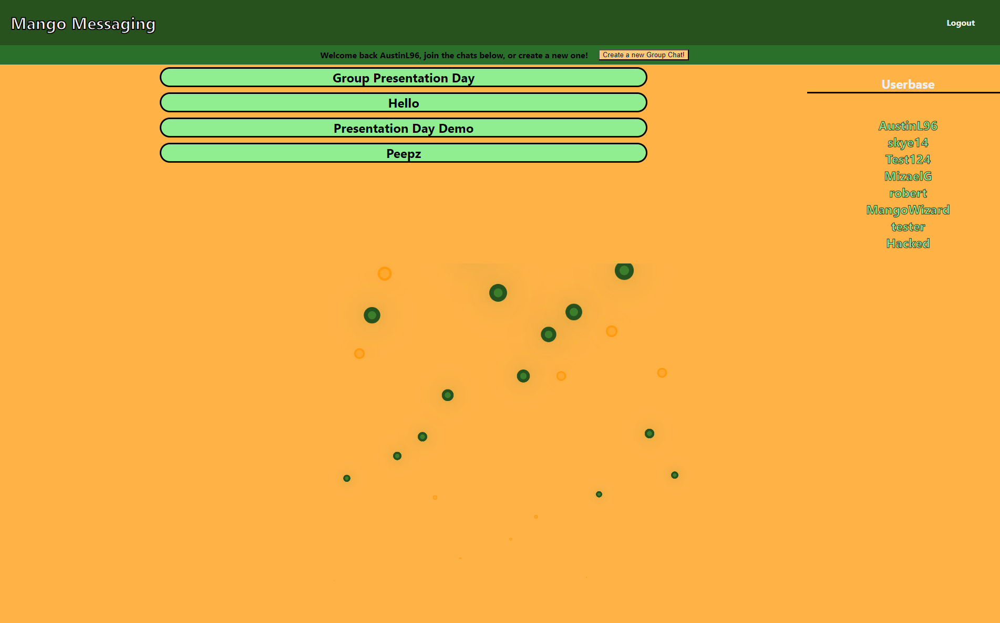
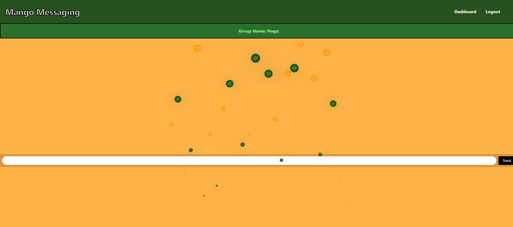

# Mango Messenger 2.0

Made a new repo, old one had issues. 
Old one can be found here: https://github.com/Palm717/mango_messenger

## Description
Mango Messenger is an app that creates chat rooms and allows signed up users to speak with each other.

## Table of Contents
* [Installation](#Installation)
* [Usage](#Usage)
* [Contributions](#Contributions)
* [Tests](#Tests)
* [License](#license)

## Installation
You will need a code editor like Visual Studio Code. Then node js and mySql installed. Once the code is copied, from there you can install the dependencies used in the package by typing "npm i" in the terminal for the copied code.

Take the template for the .env file and have it match your mySQL username and password. Then generate your database by logging into your mySQL shell and running "source ./db/schema.sql;" and making the database. Then go back to your node js terminal and write "npm run dev" and navigate to your localhost in the browser. From there you can use it locally as described in the Usage step below.

## Usage
Follow this link to the deployed [website!](https://lit-headland-28469.herokuapp.com/) From there you can register as a new user, and if you wish to, create a new chat room. Or you can enter a previously made one and see all of its previously sent messages, including the usernames of who sent them.

Below are some screenshots of the finished website!

## Contributions
 * Robert Palmer - [Palm717](https://github.com/Palm717)
 * Skye Heredia - [skye143](https://github.com/skye143)   
 * Mizael Gonzalez - [MizaelG](https://github.com/MizaelG)
 * JD Tadlock - [jdtdesigns](https://github.com/jdtdesigns)

Most contributions were made over LiveShare on Visual Studio Code, despite users seemingly not appearing to contribute on this project.

## Tests
N/A

## License
This project is licensed under the MIT license.

## Dependencies Used
* bcrypt
* connect-session-sequelize
* cookie-parser
* dotenv
* express
* express-handlebars
* mysql2
* sequelize
* socket.io
